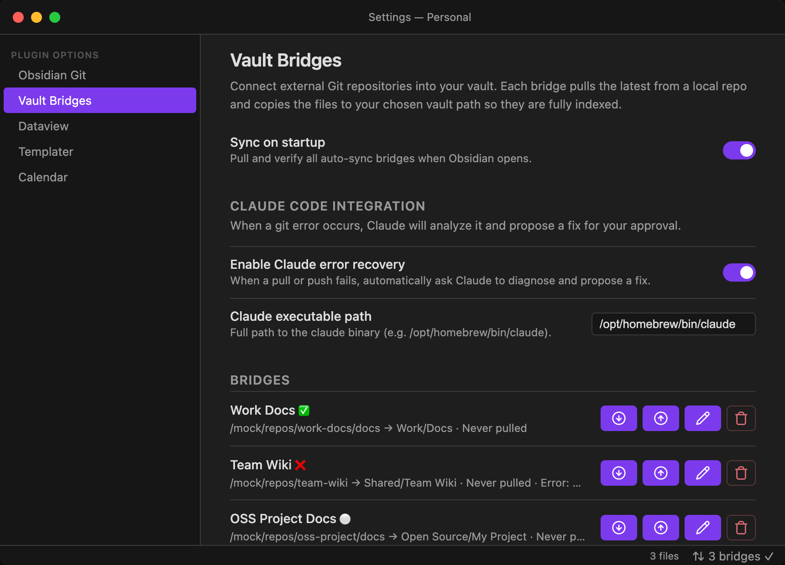
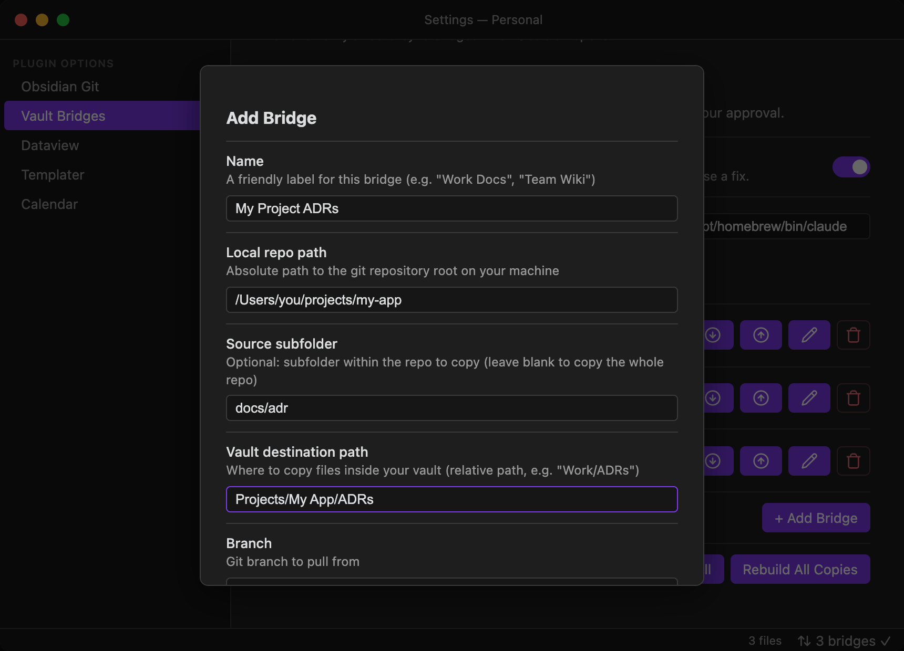
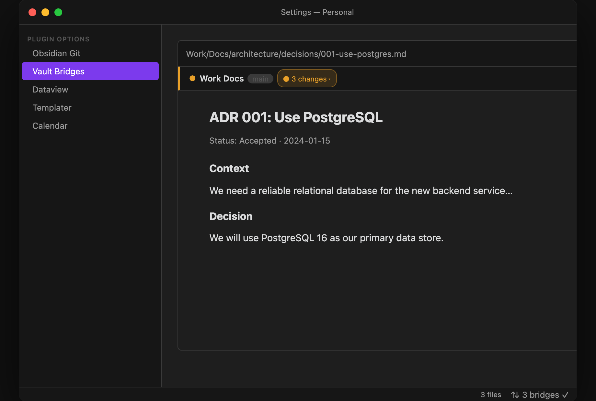
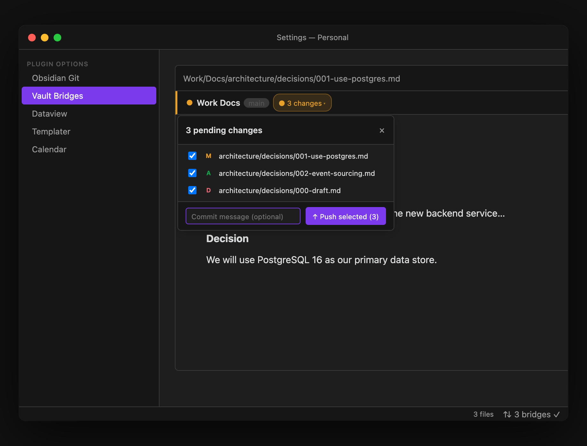

# Vault Bridges — Obsidian Plugin

**Connect external Git repositories into your vault with bidirectional sync.**

Vault Bridges lets you point at any locally-cloned Git repo (or a subfolder within one), pull the latest changes, and access those files directly inside Obsidian — as real files, fully searchable, linkable, and indexable. Edit them in Obsidian and push your changes back to Git with a single click.

---

## Screenshots





---

## Why Vault Bridges?

Obsidian is vault-bound by design. If you have notes, docs, or ADRs living in a Git repo outside your vault, your options are usually "copy them in manually" or "give up on linking them."

Vault Bridges adds a third option: a managed, bidirectional bridge that stays fresh. Each **bridge** is a named connection between a local repo (or subfolder) and a destination path in your vault. The plugin handles copying files in, pulling the latest from Git, and pushing your edits back — all from inside Obsidian.

**Common use cases:**
- Surfacing `docs/` or `ADRs/` from a work repo into your PKM
- Keeping a shared team knowledge base in sync
- Editing changelogs and READMEs from projects you maintain and committing changes back
- Linking dotfiles docs into your vault and pushing updates directly

---

## Features

- **Bidirectional sync** — pull from Git into your vault, or push edits from your vault back to the repo with a commit and push
- **Real file copies** — files are copied into the vault (not symlinked), so Obsidian fully indexes, searches, and links them
- **Bridges Sidebar View** — a dedicated side panel lists every bridge with its current status, pending change count, and Pull / Push buttons; act on any bridge without first navigating to a bridged file
- **In-editor command bar** — a slim bar appears at the top of every bridged file with Pull and Push controls so you never have to leave the document
- **Pending-changes pill** — when you have unsaved edits, a "● N changes ▾" pill shows the exact count; click it to see which files changed and selectively choose which ones to include in your next commit
- **Selective push** — check or uncheck individual files in the popdown, add an optional commit message, and push only what you want
- **Real-time change count** — the pill count updates on every file save, not just when a bridge first becomes dirty
- **Dirty detection** — tracks file modifications since the last pull; warns before overwriting unsaved vault edits with a modal offering Push then Pull, Pull anyway, or Cancel
- **Safe auto-pull on startup** — skips dirty bridges on startup and notifies you instead of silently overwriting edits
- **Automatic legacy cleanup** — any old symlinks at a bridge destination are automatically replaced with real file copies on first sync
- **Subfolder support** — bridge a whole repo or just a subdirectory (e.g. `docs/adr`)
- **Per-bridge controls** — pull, push, edit, or remove each bridge independently; separate pulled/pushed timestamps at a glance
- **Bulk actions** — Pull All, Push All, and Rebuild All Copies from the settings panel
- **Status bar indicator** — see bridge health at a glance; click to open settings
- **Desktop only** — requires local filesystem access; mobile is not supported

---

## Installation

### Option 1: BRAT (recommended for beta users)

1. Install the [BRAT plugin](https://github.com/TfTHacker/obsidian42-brat) from the Obsidian community plugins list
2. Open BRAT settings → **Add Beta Plugin**
3. Enter: `rbcodelabs/obsidian-vault-bridges`
4. Enable **Vault Bridges** in Settings → Community Plugins

### Option 2: Manual

1. Download `main.js`, `manifest.json`, and `styles.css` from the [latest release](https://github.com/rbcodelabs/obsidian-vault-bridges/releases)
2. Create the folder `.obsidian/plugins/vault-bridges/` inside your vault
3. Copy the three files into that folder
4. Restart Obsidian and enable the plugin in Settings → Community Plugins

---

## Quick Start

1. Enable the plugin in **Settings → Community Plugins → Vault Bridges**
2. Open **Settings → Vault Bridges**
3. Click **+ Add Bridge**
4. Fill in:
   - **Name** — e.g. `Work Docs`
   - **Local repo path** — e.g. `/Users/you/projects/company-docs`
   - **Source subfolder** — e.g. `docs/adr` (leave blank for the whole repo)
   - **Vault destination** — e.g. `Work/ADRs`
   - **Branch** — default `main`
5. Save — the plugin will immediately pull from Git and copy the files into your vault

Your files now appear at `Work/ADRs` inside your vault as real, fully-indexed copies.

**To pull updates:** click **↓ Pull** in the command bar at the top of any bridged file, or use the ⬇ button in Settings → Vault Bridges, or run `Vault Bridges: Sync All Bridges` from the command palette.

**To push all edits back to Git:** click **↑ Push all** in the command bar, or use the ⬆ button in the settings panel. This commits and pushes every changed file in one shot.

**To push selected files only:** click the **"● N changes ▾"** pill in the command bar. A popdown lists each modified, added, or deleted file with a checkbox. Uncheck any files you want to hold back, add an optional commit message, then click **Push selected**.

---

## In-Editor Command Bar

When you open any file that lives inside a bridge destination, a slim command bar appears between the file title and the editor content. It shows the bridge's current state and gives you Pull and Push controls without leaving the document.

### Bar States



| Icon | State | What it means |
|---|---|---|
| `✓` | Clean | All files match the last pull; nothing to push |
| `● N changes ▾` | Dirty | N files have been modified, added, or deleted since the last pull |
| `↻` | Syncing | A pull or push is in progress |
| `✕` | Error | The last operation failed; the error message is shown inline |

In the clean state the bar also shows the last-synced time (e.g. "synced 3 min ago") with the exact timestamp on hover.

### Pending-Changes Pill

When the bridge is dirty, the pill replaces the status label on the left side of the bar. Clicking it opens an inline popdown:



- **File list with badges** — each changed file is listed with an `M` (modified), `A` (added), or `D` (deleted) badge and a checkbox checked by default
- **Commit message field** — optional; leave blank to get an auto-generated timestamped message
- **Push selected button** — the button label shows how many files are currently checked; it updates live as you check and uncheck files

Click outside the popdown, press Escape, or click the pill again to dismiss without pushing.

### Push all vs. Push selected

The **↑ Push all** button on the right side of the bar always commits and pushes every changed file immediately, the same as the ⬆ button in the settings panel. Use this when you want a fast one-click commit of everything.

**Push selected** (via the pill popdown) is for when you want to review the diff list, exclude certain files from the commit, or write a custom commit message.

---

## Bridges Sidebar View

The Bridges Sidebar View lets you see all your bridges and act on any of them without first navigating to a file inside a bridge destination. It is especially useful when you want to pull or push across multiple bridges in one session.

**To open the sidebar:** run `Vault Bridges: Open Bridges Sidebar` from the command palette, or click the bridge icon in the left ribbon.

### What it shows

Each bridge gets a card with:

- **Status icon** — `✓` (clean), `●` (dirty/pending changes), `↻` (syncing), or `✕` (error)
- **Bridge name** and **branch** pill
- **Pull** and **Push** buttons — same actions as the in-editor command bar, available without opening a file
- **Changes pill** — when a bridge has pending changes, a "● N changes ▾" pill shows the count; click it to expand the file list inline
- **Expanded file list** — shows each changed file with an `M` / `A` / `D` badge, an open-in-tab button, and a commit message field; a push button at the bottom commits and pushes all listed files

### Header actions

Two buttons at the top of the sidebar act on all bridges at once:

| Button | Action |
|---|---|
| ↓ Pull all | Pull every bridge (git pull + copy files into vault) |
| ↑ Push all | Push every bridge that has pending changes |

### PR mode

When a bridge's **PR mode** is enabled, the Push button changes to **Open PR** and a PR status panel appears below the bridge card after a PR is opened. From there you can check PR status, merge, or open the PR in your browser — all without leaving Obsidian.

---

## Configuration Reference

### Settings Panel

| Setting | Description |
|---|---|
| **Sync on startup** | Pull all auto-sync bridges when Obsidian opens (pull only; push is always manual) |

### Per-Bridge Fields

| Field | Required | Description |
|---|---|---|
| **Name** | Yes | Display label for this bridge |
| **Local repo path** | Yes | Absolute path to the git repo root on your machine (must already be cloned) |
| **Source subfolder** | — | Subfolder within the repo to copy. Leave blank to copy the entire repo root |
| **Vault destination path** | Yes | Relative path inside your vault where files will be copied |
| **Branch** | Yes | Git branch to pull from and push to (default: `main`) |
| **Auto sync on startup** | — | Pull this specific bridge when Obsidian opens |

### Per-Bridge Controls

The settings panel has per-bridge buttons. The same actions are available faster from the in-editor command bar when you have a bridged file open.

| Button | Action |
|---|---|
| ⬇ (arrow-down-circle) | **Pull** — `git pull` then copy repo files into the vault |
| ⬆ (arrow-up-circle) | **Push all** — copy all changed vault files back to the repo, commit, and push |
| Pencil | Edit this bridge's configuration |
| Trash | Remove this bridge (does not delete vault files) |

### Status Indicators

| Icon | Meaning |
|---|---|
| ✅ | Last sync succeeded |
| ❌ | Last sync failed — hover or open settings to see the error |
| 🔄 | Currently syncing |
| ⚪ | Never synced |

---

## Commands

Access via **Cmd/Ctrl+P**:

### Bulk commands

| Command | Description |
|---|---|
| `Vault Bridges: Sync All Bridges` | Pull all bridges (git pull + copy files into vault) |
| `Vault Bridges: Push All Bridges` | Push all bridges (copy vault files to repo, commit, and push all changes) |
| `Vault Bridges: Rebuild All Copies` | Re-copy all files from repos into the vault — useful after moving the vault or if files get out of sync |

Individual bridge pull and push are also available from the **Settings → Vault Bridges** panel and from the **in-editor command bar** when a bridged file is open.

### Per-bridge commands

For every configured bridge, two commands are registered automatically:

| Command pattern | Description |
|---|---|
| `Vault Bridges: Pull "<bridge name>"` | `git pull` then copy files into the vault for this bridge |
| `Vault Bridges: Push "<bridge name>"` | Copy vault files back to the repo, commit, and push for this bridge |

Per-bridge commands appear in the palette immediately when a bridge is added (no restart required) and update their label if you rename a bridge. You can assign hotkeys to them in **Settings → Hotkeys** just like any other command.

---

## Public API

Other plugins can drive Vault Bridges programmatically via the plugin's public API. No runtime dependency is needed — just look up the plugin instance:

```typescript
const vb = (this.app as any).plugins.plugins['vault-bridges'];

// Check it's loaded before using
if (vb?.api) {
  await vb.api.addBridge({
    name: 'Agentic PM Playbook',
    repoPath: '/Users/rick/projects/agent-pm-playbook',
    vaultPath: 'Playbooks/Agentic PM Playbook',
    syncNow: true,
  });
}
```

For full type safety, import the types (no runtime coupling):

```typescript
import type { VaultBridgesAPI, AddBridgeOptions } from 'vault-bridges/src/VaultBridgesAPI';
```

### API Methods

| Method | Description |
|---|---|
| `getBridges()` | Returns a snapshot of all configured bridges |
| `addBridge(options)` | Adds a new bridge; deduplicates by `repoPath + vaultPath`; optional `syncNow` flag triggers an immediate pull |
| `removeBridge(id)` | Removes a bridge by id; no-ops if not found |
| `syncBridge(id)` | Triggers a pull (repo → vault) for the bridge with the given id |
| `pushBridge(id)` | Triggers a push (vault → repo) for the bridge with the given id |

### `addBridge` options

| Option | Type | Required | Default | Description |
|---|---|---|---|---|
| `name` | `string` | ✅ | — | Display label for the bridge |
| `repoPath` | `string` | ✅ | — | Absolute path to the local git repo root |
| `vaultPath` | `string` | ✅ | — | Vault-relative destination path |
| `sourcePath` | `string` | — | `''` | Subfolder within the repo to copy (blank = whole repo) |
| `branch` | `string` | — | `'main'` | Git branch to pull from / push to |
| `autoSync` | `boolean` | — | `true` | Pull this bridge automatically on Obsidian startup |
| `syncNow` | `boolean` | — | `false` | Immediately pull from Git after adding |

---

## Known Limitations

- **Repo must be cloned locally** — the plugin does not clone repos from a URL. You need to have the repo on disk already.
- **No mobile support** — requires local filesystem access not available on Obsidian Mobile.
- **Vault move** — if you move your vault, run `Vault Bridges: Rebuild All Copies` to re-copy files at the new location.
- **Obsidian Git coexistence** — if your vault is itself a git repo managed by Obsidian Git, add your bridge destination paths to the vault's `.gitignore` to prevent double-tracking.
- **The command bar only appears for bridged files** — opening a regular vault note (outside any bridge destination) shows no bar.

---

## Development

```bash
git clone https://github.com/rbcodelabs/obsidian-vault-bridges
cd obsidian-vault-bridges
npm install

# Watch mode — rebuilds on every save
npm run dev

# Type-check only
npm run typecheck

# Production build + copy to vault
npm run deploy
```

The plugin is written in TypeScript and uses esbuild for bundling. Source files live in `src/`; the entry point is `main.ts`.

See [Development Guide](docs/development.md) for architecture details, adding new features, and testing.

---

## Contributing

Issues and PRs welcome. If you have a use case that isn't covered — clone-from-URL, sync scheduling, conflict resolution — please open an issue first to discuss the approach before building.

---

## License

MIT © Rick Bowman
